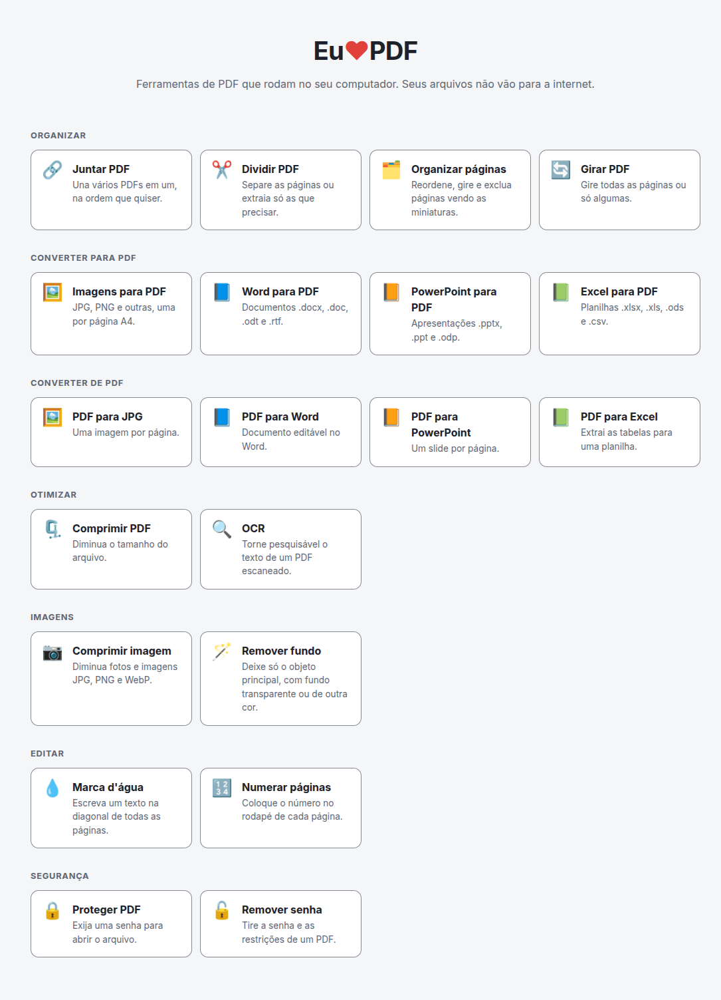
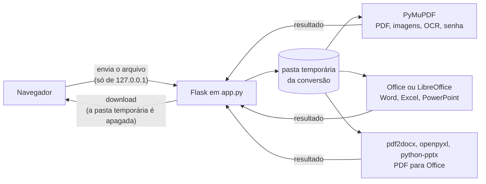

<div align="center">

# Eu❤️PDF

**Ferramentas de PDF que rodam no seu computador.**<br>
Juntar, dividir, comprimir, converter, OCR, senha e remover o fundo de imagens, sem enviar nenhum arquivo para a internet.

[](https://github.com/GianBala/EuAmoPDF/actions/workflows/tests.yml)


[O que faz](#o-que-faz) · [Começar](#começar) · [Programas opcionais](#programas-opcionais) · [Como funciona](#como-funciona) · [Testes](#testes)

</div>

---

Os sites de PDF cobram pelas funções mais úteis e recebem uma cópia de tudo o que você envia: contratos, documentos pessoais, boletos. O EuAmoPDF faz o mesmo trabalho **na sua máquina**. Ele abre no navegador, mas o servidor é local, só aceita conexões do próprio computador, e cada arquivo é apagado assim que a conversão termina.

<p align="center">
  
</p>

## O que faz

<table>
<tr>
<td width="50%" valign="top">

### 🗂️ Organizar

- **Juntar** vários PDFs, na ordem que você escolher
- **Dividir** em um PDF por página, ou extrair só algumas (`1-3, 5, 8`)
- **Organizar páginas** vendo as miniaturas: arrastar, girar e excluir
- **Girar** todas as páginas ou só as indicadas

### ⚡ Otimizar

- **Comprimir PDF**, reduzindo a resolução das imagens (o texto não perde qualidade), com o **tamanho final estimado** antes de comprimir
- **OCR** em PDFs escaneados: o texto passa a poder ser buscado e copiado, sem mudar a aparência

### 🖼️ Imagens

- **Comprimir imagens** JPG, PNG e WebP, uma ou várias de uma vez, com quatro níveis de compressão, tamanho máximo, troca de formato, remoção dos dados da foto (localização, câmera) e o tamanho final estimado
- **Remover fundo** com IA, deixando só o objeto principal: fundo transparente, branco, preto ou de outra cor. A imagem mantém a resolução, as cores e os pixels originais do objeto, e sai sem perda (PNG ou WebP)

### ✏️ Editar e 🔒 Segurança

- **Marca d'água** em texto, na diagonal de todas as páginas
- **Numerar páginas** no rodapé (`1`, `1 / 10` ou `Página 1 de 10`)
- **Proteger** com senha (AES-256) e **remover senha** ou restrições de impressão e cópia

</td>
<td width="50%" valign="top">

### ➡️ Converter para PDF

- **Imagens** (JPG, PNG, WebP, GIF, TIFF…), uma por página A4, respeitando a orientação da foto
- **Word** (`.docx`, `.doc`, `.odt`, `.rtf`)
- **PowerPoint** (`.pptx`, `.ppt`, `.odp`)
- **Excel** (`.xlsx`, `.xls`, `.ods`, `.csv`)

### ⬅️ Converter de PDF

- **JPG**, uma imagem por página, em 72, 150 ou 300 DPI
- **Word** editável
- **PowerPoint**, com um slide por página (como imagem)
- **Excel**, com cada tabela do PDF numa aba

</td>
</tr>
</table>

## Começar

```bash
git clone https://github.com/GianBala/EuAmoPDF.git && cd EuAmoPDF
python3 -m venv venv
venv/bin/pip install -r requirements.txt
venv/bin/python app.py
```

No Windows, use `venv\Scripts\pip` e `venv\Scripts\python`. O navegador abre sozinho em `http://127.0.0.1:5000` (ou em outra porta, se a 5000 estiver ocupada). Para fechar o app, aperte `Ctrl+C` no terminal.

## Programas opcionais

A maior parte das ferramentas funciona só com o que o `pip` instala. Duas precisam de um programa a mais, e a ferramenta avisa quando ele estiver faltando:

| Ferramenta | Precisa de | Linux (Debian/Ubuntu) | Windows |
|---|---|---|---|
| Word, PowerPoint e Excel para PDF | Microsoft Office **ou** LibreOffice | `sudo apt install libreoffice` | Usa o Microsoft Office, se houver; senão, instale o [LibreOffice](https://pt-br.libreoffice.org/baixe-ja/) |
| OCR | Tesseract com o idioma português | `sudo apt install tesseract-ocr tesseract-ocr-por` | Instale o [Tesseract da UB Mannheim](https://github.com/UB-Mannheim/tesseract/wiki) e marque **Portuguese** em *Additional language data* |

No Windows, o LibreOffice e o Tesseract são encontrados na pasta padrão de instalação (`Program Files`), mesmo fora do `PATH`.

O **Remover fundo** não precisa de nada a instalar: na primeira vez, o app baixa sozinho o modelo de IA ([ISNet](https://github.com/xuebinqin/DIS), 170 MB) para `~/.cache/euamopdf` no Linux ou `%LOCALAPPDATA%\euamopdf` no Windows, e confere o arquivo pelo SHA-256. Depois disso funciona sem internet, e as imagens nunca saem do computador. O modelo usa cerca de 800 MB de memória enquanto trabalha e leva por volta de 1 segundo por foto.

## Como funciona



- **Um servidor local.** O `app.py` é um app Flask que só escuta em `127.0.0.1` e recusa requisições cujo `Host` ou `Origin` não seja local. Assim, um site aberto em outra aba não consegue usar o app.
- **Nada fica no disco.** Cada conversão usa uma pasta temporária própria, grava os envios com nomes gerados pelo app (nunca com o nome que veio do navegador) e é apagada ao terminar. O resultado vai direto da memória para o download.
- **O PyMuPDF faz o trabalho pesado:** juntar, dividir, girar, gerar imagens das páginas, comprimir, criptografar, escrever marca d'água e números, extrair tabelas e rodar o OCR pelo Tesseract.
- **O remover fundo** roda o ISNet pelo `onnxruntime`: o modelo gera só a máscara do objeto, em 1024 × 1024, que é ampliada para o tamanho da imagem e vira o canal de transparência. Os pixels do objeto não são alterados, e os pixels totalmente transparentes são zerados, para o fundo removido não ficar escondido no arquivo.
- **A interface** (`templates/index.html`, `static/`) é HTML, CSS e JavaScript simples, sem bibliotecas nem CDN, então funciona sem internet. Ela tem modo escuro automático e dá para usar pelo teclado.

## Testes

```bash
venv/bin/pip install -r requirements-dev.txt
venv/bin/pytest
```

Os testes geram os PDFs e as imagens na hora e cobrem todas as ferramentas, as mensagens de erro, a segurança (nomes de arquivo maliciosos, requisições de outros sites) e a limpeza dos arquivos temporários. Os testes do Office e do OCR são pulados quando o LibreOffice ou o Tesseract não estão instalados. O [GitHub Actions](.github/workflows/tests.yml) roda tudo no Linux, com LibreOffice e Tesseract, e no Windows.

## Licença

[AGPL-3.0](LICENSE), a mesma do [PyMuPDF](https://pymupdf.readthedocs.io/), do qual o projeto depende. O modelo ISNet, baixado no primeiro uso do Remover fundo, é do projeto [DIS](https://github.com/xuebinqin/DIS), sob a licença Apache-2.0.
